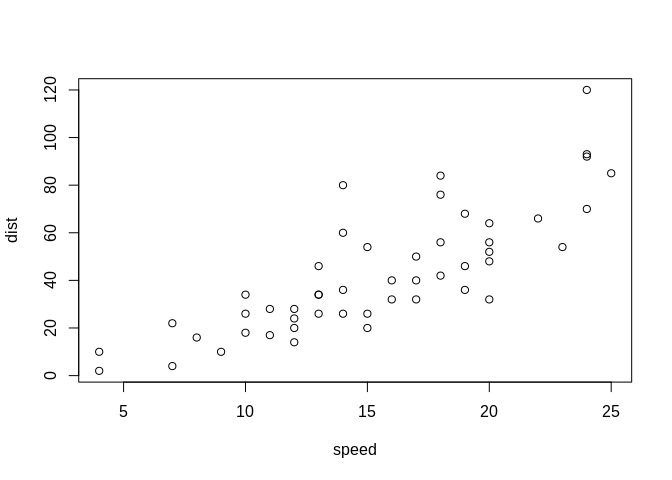

R Notebook
================

This is an [R Markdown](http://rmarkdown.rstudio.com) Notebook. When you
execute code within the notebook, the results appear beneath the code.

Try executing this chunk by clicking the *Run* button within the chunk
or by placing your cursor inside it and pressing *Ctrl+Shift+Enter*.

``` r
plot(cars)
```

<!-- -->
